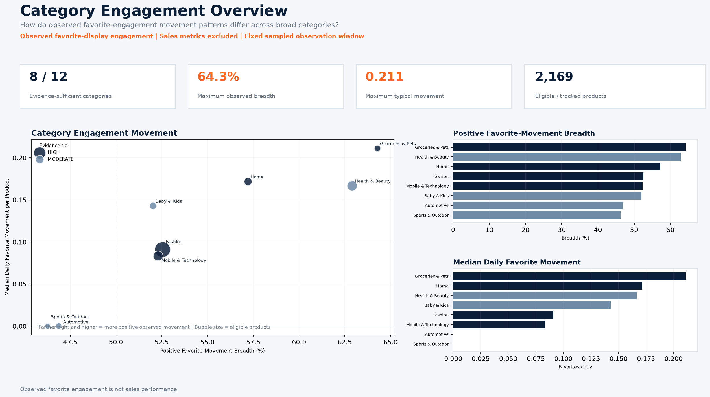
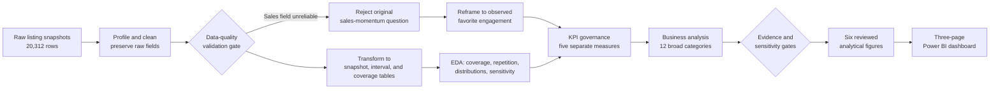

# Shopee Category Engagement Analytics

An end-to-end analytics project that investigates a sampled Shopee listing dataset, rejects an unreliable sales metric, and builds a governed category-engagement analysis and Power BI dashboard from defensible evidence.



## Business problem

The original goal was to identify categories gaining sales momentum and recommend campaign priorities. Data-quality investigation showed that the dataset cannot support that decision: `total_sold` could not be independently trusted as sales, observation coverage was uneven, and the file is a listing sample rather than a platform census.

Instead of forcing the original question, the project asks:

> Which Broad Product Categories show stronger observed favorite-engagement movement among eligible repeatedly tracked listings in this 20-day sampled dataset, when breadth, typical per-day movement, sampled scale, and evidence sufficiency are reported separately?

This is an engagement analysis, not a sales, demand, growth, or campaign-performance analysis.

## Analytical journey



The key analytical decision was simple: an unreliable metric was not used merely because it matched the original business request.

## Data overview

| Item | Validated scope |
|---|---|
| Source | Sampled Shopee Malaysia listing snapshots |
| Window | 2023-04-24 to 2023-05-13, 20 observed dates |
| Rows | 20,312 listing snapshots |
| Products | 16,614 distinct product IDs |
| Publication grain | 12 governed Broad Product Categories |
| Preserved detail | 24 original Level-2 categories |
| Primary movement cohort | Exact favorite displays, positive elapsed intervals, stable Level-2 history |

The raw source remains immutable at `dataset/shopee_sales_data.csv`; its SHA-256 is documented in the [data dictionary](docs/data_dictionary.md).

## Critical data-quality findings

| Issue | Analytical impact | Decision |
|---|---|---|
| `total_sold` cannot be independently validated as sales | Sales, revenue, and growth calculations would be unsupported | Block it from the KPI framework |
| `total_rating` cannot be independently verified | It cannot validate or replace the blocked sales field | Retain as unverified source information only |
| Daily listing coverage is uneven | Raw listing totals can reflect scraper composition rather than platform change | Use matched repeated observations and report sampled scale separately |
| Compact favorite displays are rounded | Small movements can depend on display precision | Use exact displays as primary; compact-inclusive results only as sensitivity |
| Some products change Level-2 category | Category histories can become contaminated | Exclude those products from governed movement cohorts |
| Only a subset of products repeat | Longitudinal support differs by category | Apply evidence gates and publish insufficient movement as N/A, never zero |

See the [data-quality issue register](reports/data_quality_issue_register.md) and [business-question governance](docs/business_question_governance.md) for the full evidence trail.

## Governed methodology

The analysis keeps five approved measures separate:

1. Observed Stable-Category Product Count
2. Eligible Favorite-Movement Product Count
3. Positive Favorite-Movement Breadth
4. Median Daily Favorite Movement per Product
5. Evidence Sufficiency Tier

The primary result uses exact favorite displays and one product-level summary before category aggregation. Compact-inclusive, outlier-excluded, and interval-weighted calculations are separate sensitivity scenarios. No composite momentum score or unsupported category ranking is created.

Important decisions and their consequences are documented in [KPI definitions](docs/kpi_definitions.md) and [business-question governance](docs/business_question_governance.md).

## Key findings

| Broad Product Category | Eligible products | Positive breadth | Median favorites/day | Evidence | Sensitivity |
|---|---:|---:|---:|---|---|
| Groceries & Pets | 112 | 64.29% | 0.211 | HIGH | Directionally stable |
| Health & Beauty | 337 | 62.91% | 0.167 | MODERATE | Robust |
| Home | 194 | 57.22% | 0.172 | HIGH | Unstable |
| Fashion | 881 | 52.55% | 0.091 | HIGH | Unstable |

- Evidence distribution: 4 HIGH, 4 MODERATE, and 4 INSUFFICIENT categories.
- Groceries & Pets has the strongest publishable primary breadth, but its compact-inclusive result is materially weaker.
- Health & Beauty shows a robust positive sampled pattern, but evidence remains MODERATE.
- Fashion, Home, and Mobile & Technology have HIGH evidence but sensitivity-unstable results.
- No category passes the complete formal gate for further business investigation.
- Entertainment & Hobbies, Others, Tickets & Vouchers, and Travel retain evidence diagnostics while movement KPIs remain N/A.

These findings describe sampled favorite-display movement. They do not establish sales growth, platform growth, demand, conversion, market share, causality, or campaign priority.

## Decision implications

- Do not prioritize a category for a campaign from this dataset alone; no category passes the complete analytical follow-up gate.
- Treat Groceries & Pets and Health & Beauty as monitoring hypotheses, not commercial recommendations: the former is only directionally stable and the latter has MODERATE evidence.
- The highest-value next evidence is longer, more regular repeated-listing coverage plus independently verified conversion or commercial outcomes.
- Preserve N/A for insufficient groups until the evidence gate is met rather than filling gaps with zeros or weaker proxies.

## Power BI dashboard

The source-controlled PBIP/PBIR project is [Shopee_Category_Engagement.pbip](dashboard/Shopee_Category_Engagement.pbip) and contains exactly three pages:

1. Category Engagement Overview
2. Category Evidence Deep Dive
3. Evidence & Limitations

Python owns eligibility, aggregation, Wilson intervals, evidence classification, and sensitivities. Power BI owns presentation and filtering. The model embeds the two small governed publication facts during deterministic generation, avoiding machine-specific source paths.

Dashboard architecture and refresh instructions are in [phase_9_dashboard_architecture.md](docs/phase_9_dashboard_architecture.md).

## Reproduce the project

From the repository root with Python 3.11+ and Power BI Desktop:

```powershell
python -m venv .venv
.venv\Scripts\Activate.ps1
python -m pip install -r requirements.txt
```

Run the pipeline in dependency order:

```powershell
python src/data/profile_data.py
python src/data/clean_data.py
python tests/data_validation/validate_processed_data.py
python src/data/transform_data.py
python tests/data_validation/validate_transformed_data.py
python tests/data_validation/validate_broad_product_category.py
python src/analysis/run_phase_5_eda.py
python tests/data_validation/validate_phase_5_eda.py
python src/analysis/build_phase_6_kpi_specs.py
python tests/data_validation/validate_phase_6_kpi_design.py
python src/analysis/run_phase_7_business_analysis.py
python tests/data_validation/validate_phase_7_business_analysis.py
python src/visualization/create_phase_8_visuals.py
python tests/data_validation/validate_phase_8_visuals.py
python src/dashboard/build_phase_9_powerbi_project.py
python src/dashboard/render_phase_9_previews.py
python tests/data_validation/validate_phase_9_dashboard.py
```

Then open `dashboard/Shopee_Category_Engagement.pbip` in Power BI Desktop. The final native page-render and interaction walkthrough remains a documented manual QA step.

## Repository structure

```text
dataset/                 Current immutable raw source location
data/processed/          Cleaned and analytical tables
src/data/                Profiling, cleaning, and transformation
src/analysis/            EDA, KPI specifications, and business analysis
src/visualization/       Reproducible analytical figures
src/dashboard/           Deterministic PBIP/PBIR and preview builders
tests/data_validation/   Executable integrity and business-rule checks
outputs/tables/          Governed facts and validation results
outputs/figures/         EDA, analytical, and dashboard preview figures
dashboard/               Source-controlled Power BI project
docs/                    Definitions, contracts, governance, and architecture
reports/                 Phase evidence and audit reports
```

## Tools

- Python, pandas, NumPy, Matplotlib
- Power BI Desktop, PBIP/PBIR, Power Query, DAX
- Git and SHA-256 lineage checks

## What this project demonstrates

- Data profiling, cleaning, transformation, and validation
- Reproducible analytics engineering and source-to-dashboard lineage
- Business-question refinement when source data cannot support the original request
- Explicit KPI grain, denominator, eligibility, and missing-value governance
- Wilson uncertainty, small-sample controls, and sensitivity analysis
- Clear separation between observed signals and commercial claims
- Evidence-aware visualization and maintainable Power BI delivery

## Professional reflection

Metric validation comes before metric calculation. Evidence quality is part of the result, sensitivity disagreement is information rather than noise, and N/A is more honest than false precision. The strongest outcome of this project is not a winning category; it is a defensible analytical process that knows where the data stops.

Current formal status is maintained in [project_status.md](docs/project_status.md).
